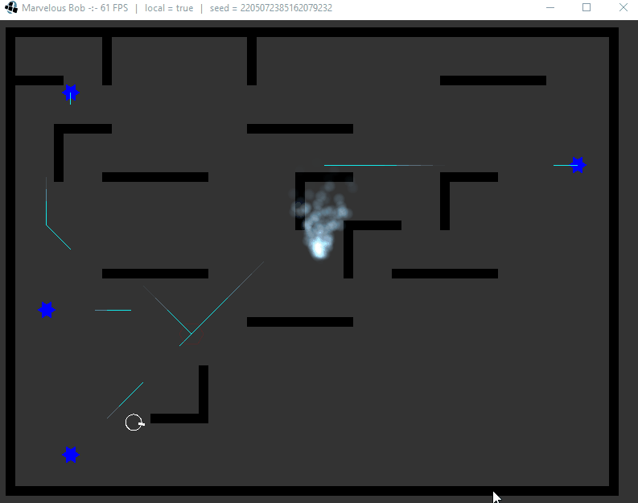
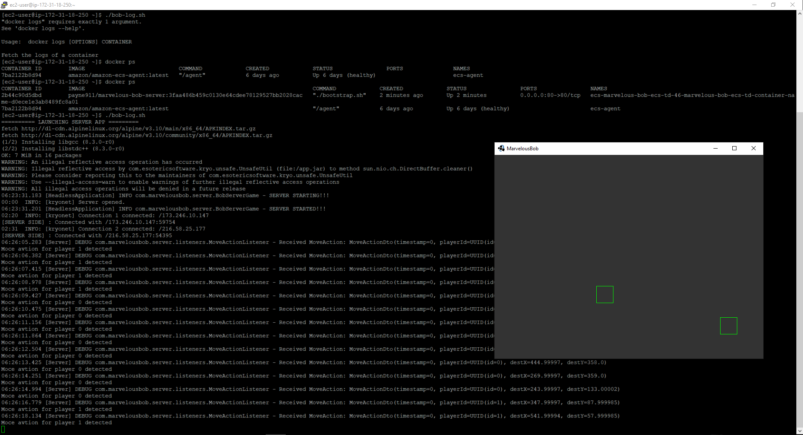
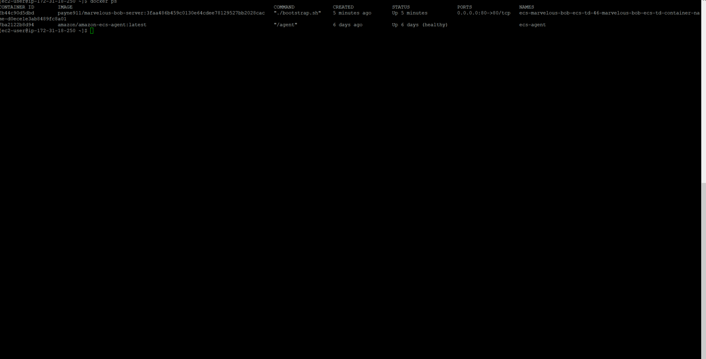
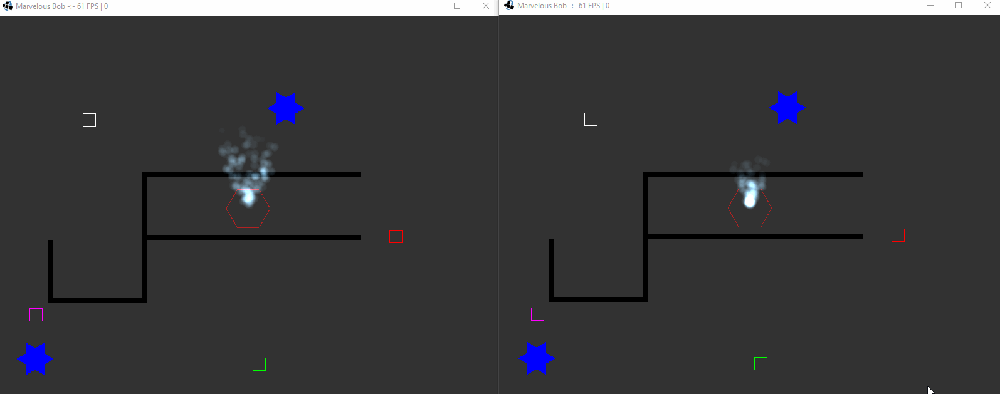

# Marvelous Bob
Top-down multiplayer coop Defend-Your-Base game.

Below is a showcase of the procedurally generated levels and some of the core mechanics.

## Project structure
This repository contains 4 modules:
  1) client
  2) server
  3) common
  4) desktop

The ``common`` is used by both the ``server`` and the ``client``.

The ``desktop`` is the launcher for the ``client``.

### Other folders
* ``.github``: CI/CD (GitHub Actions)
* ``.run``: the provided IntelliJ `Run Configuration`
* ``utils``: miscellaneous stuff for the developers

## Tech Stack
### Common to all modules
* Java 14 (language)
* Gradle (build)
* JPackage + JLink (lightweight releases)
* [libGDX](https://libgdx.badlogicgames.com/download.html) (framework)
* [KryoNet](https://github.com/crykn/kryonet) (networking)
* Lombok (boilerplate)
* Slf4j (logging)
### Server module
* AWS ECS (cloud)
* Docker (container)
* GitHub Actions (CI/CD)

## (older) Demonstrations

Above is a static image showing the console once SSH'd into the server. Below is a recording of that same interaction. In both cases, two different computers were used to connect to the remote server.

Below is a recording of me manipulating 2 clients (green and white) simultaneously connected to the remote server, while my partner manipulates 2 other clients on his own computer (red and purple).

## Useful references concerning real-time multiplayer games
* Short and sweet, a high-level overview of the different challenges, with images: [Client-Server Game Architecture](https://www.gabrielgambetta.com/client-server-game-architecture.html)
* Very detailed step-by-step coding guide specifically for a libGDX game: [Developing Lag Compensated Multiplayer Game](https://www.schibsted.pl/blog/developing-lag-compensated-multiplayer-game-pt-1/)
* Deep dive into the complexities of OverWatch's NetCode: [Overwatch Gameplay Architecture and Netcode](https://www.youtube.com/watch?v=W3aieHjyNvw&ab_channel=GDC)